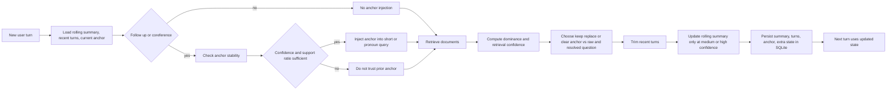

# Syracuse Research Assistant

A local retrieval-augmented generation application for Syracuse research discovery. The application ingests paper records into Chroma, retrieves and filters evidence, tracks short-term conversational state across turns, and serves answers through a Streamlit chat interface or an interactive terminal chat. It also includes an optional graph view that turns retrieved papers into a lightweight entity-relationship network.

This README is code-aware: it describes how the modules in this snapshot actually behave, what each major function contributes, and how data moves from retrieval to answer generation.

> **Scope note.** This document was reviewed against the modules present in the current source snapshot: `cache_manager.py`, `conversation_memory.py`, `database_manager.py`, `rag_chat.py`, `rag_engine.py`, `rag_graph.py`, `rag_pipeline.py`, `rag_utils.py`, `runtime_settings.py`, `session_store.py`, and `streamlit_app.py`. Files referenced by these modules but **not** included in the snapshot — `config_full.py` (required at import time), and the standalone `chroma_ingest.py` / `benchmark_rag.py` scripts — are described from their usage and flagged where relevant. `config_graph.py` is **not** imported by any module in this snapshot; Neo4j database selection currently flows through `config_full` via `DatabaseManager`.

## Table of contents

1. Project summary
2. Main capabilities
3. Repository structure
4. End-to-end flow
5. File-by-file technical reference
6. Retrieval behavior
7. Data contracts
8. Setup and local execution
9. Running the entry points
10. Runtime operations
11. Strengths and limitations

## Project summary

At a practical level, the application solves four problems:

1. It retrieves relevant paper chunks for a user question from a Chroma vector store, with additional logic for follow-ups, person-centered questions, paper pinning, anchor stability, and retrieval confidence.
2. It maintains a rolling summary and recent turns so follow-up questions resolve without losing topic continuity.
3. It grounds answers in retrieved evidence and applies post-generation guards that strip fabricated citations and unsupported researcher claims.
4. It renders the interaction across two surfaces — Streamlit and an interactive terminal chat — and supports switching datasets, retrieval modes, and answer models at runtime.

Corpus ingestion (building the Chroma collections) is handled by separate ingestion tooling that is not part of this snapshot.

## Main capabilities

### Three retrieval modes

Independent of which dataset is active, each turn runs in one of three retrieval modes (a sidebar radio in Streamlit, or the `rag_mode` argument to `answer_question`):

1. `full` — paper retrieval **plus** conversation memory plus the model. The default.
2. `memory` — no paper database; answers from conversation memory and the rolling summary only.
3. `off` — model only; optionally keeps the most recent turn for coreference.

Modes `memory` and `off` are handled by `_answer_no_db`, which skips paper retrieval entirely.

### Multiple datasets under one UI

Three corpus modes are registered and selectable at runtime:

1. `full` — the legacy corpus with full paper text, labeled **Legacy DB** in the UI.
2. `openalex` — papers ingested from OpenAlex with Docling-extracted full text, labeled **OpenAlex DB**.
3. `abstracts` — OpenAlex records using abstracts only, labeled **Abstracts Only**.

Each mode has its own Chroma directory, Chroma collection, and Neo4j database name. Switching datasets in the Streamlit sidebar or via the `/db` command in the terminal flips the active Chroma store; the active Neo4j name is exposed through `DatabaseManager.get_active_neo4j_db()`.

### Multiple answer models, local and hosted

Answer models are selectable at runtime and switched by `EngineManager.switch_answer_model()`. The terminal client exposes the local models; the Streamlit UI adds hosted API models and filters the list by available VRAM.

Local models:

| Label | Key | Quantization |
| --- | --- | --- |
| LLaMA 3.2 3B | `llama-3.2-3b` | none (fp16) |
| LLaMA 3.1 8B | `llama-3.1-8b` | 4-bit |
| Gemma 4 E2B | `gemma-4-e2b` | 4-bit |
| Gemma 4 E4B | `gemma-4-e4b` | 4-bit |
| Qwen 2.5 14B | `qwen-2.5-14b` | 4-bit |
| Gemma 4 26B-A4B | `gemma-4-26b` | 4-bit |
| GPT-OSS 20B | `gpt-oss-20b` | 4-bit |
| Gemma 4 31B | `gemma-4-31b` | 4-bit |

API models (Streamlit only, require a key entered in the sidebar or set in the environment): `gpt-4o`, `gpt-4o-mini`, and Claude Opus / Sonnet / Haiku identifiers.

Switching a model closes the previous runtime, runs garbage collection, and empties the CUDA cache before loading the new one.

### Retrieval first, generation second

The system is built so retrieval drives the answer path. The prompt instructs the model to stay grounded in the retrieved Syracuse corpus, and several downstream checks downgrade or replace answers when retrieval is weak.

### Conversation continuity through anchors

The system tracks a current anchor — the dominant subject inferred from recent retrieval and conversation state, stored as `{type, value, source, confidence}` where `type` is typically `researcher`, `paper`, or `metadata`. Short or pronoun-based follow-ups are interpreted relative to that anchor when evidence is strong enough. Anchor validation checks both the raw user question and the resolved question, preventing spurious anchor drift when follow-ups use pronouns.

### Paper pinning, similarity, and full-text expansion

Quoting or paraphrasing a paper title pins the conversation to that paper's `paper_id`, so follow-ups are scoped to it. A "papers like this" request triggers similarity search over the corpus, and a "tell me more about this paper" request pulls in body chunks (full-text expansion) rather than only the abstract, raising the prompt's per-document size and document count accordingly.

### Weak-evidence handling

The pipeline distinguishes confident, weak, and inconsistent retrieval. When evidence quality drops, the prompt is narrowed, guardrails become stricter, and the pipeline can fall back to safer extractive answers. Confidence downshifting for person queries is calibrated so that initial-format name matches such as "D. Brown" matching "Duncan Brown" are treated as strong evidence rather than triggering unnecessary downgrades.

### Citation grounding and hallucination prevention

After generation, the pipeline validates quoted paper titles against the retrieved document set using fuzzy matching and strips lines containing fabricated citations before the answer reaches the user. A separate bidirectional-name check replaces answers that credit researchers not supported by the evidence.

### Meta-query handling

Questions like "how many papers does the corpus contain", "what is the most recent paper", and short commands such as "switch topic" are intercepted before retrieval and answered directly from the active Chroma collection or by clearing state, avoiding a wasted retrieval round.

### Local-friendly runtime behavior

The application targets local model paths, persistent Chroma storage, offline-friendly execution, and explicit session-reset controls. Model loading includes a GPU/CPU memory budget with disk offload so large models degrade to CPU/disk rather than failing outright.

## Repository structure

Modules present in this snapshot:

```
.
|-- cache_manager.py          # cache-key helpers + cache clearing (not imported by runtime)
|-- conversation_memory.py    # hard reset entry point
|-- database_manager.py       # dataset/corpus mode registry
|-- rag_chat.py               # interactive terminal chat
|-- rag_engine.py             # runtime core: models, retrieval, engine manager
|-- rag_graph.py              # in-memory graph from retrieved docs
|-- rag_pipeline.py           # orchestration: answer_question
|-- rag_utils.py              # shared helpers
|-- runtime_settings.py       # runtime tuning surface
|-- session_store.py          # SQLite session state
`-- streamlit_app.py          # web UI
```

Referenced but not included in this snapshot:

```
config_full.py     # REQUIRED at import time — model paths, Chroma dirs/collections, EMBED_MODEL, Neo4j names
chroma_ingest.py   # standalone ingestion script (builds the Chroma corpus)
benchmark_rag.py   # standalone benchmark harness
config_graph.py    # not imported by any module here
```

## End-to-end flow

```mermaid
flowchart TD
    U[User submits question] --> UI1[Entry point appends user message]
    UI1 --> P0[rag_pipeline.answer_question]

    P0 --> V1[Validate question]
    V1 --> MC{Meta command like switch topic}
    MC -->|yes| MCANS[Clear state and return]
    MC -->|no| MODE{rag_mode off or memory}
    MODE -->|yes| NODB[_answer_no_db model or memory only, no paper retrieval]
    MODE -->|no| META{Meta query how many or most recent paper}
    META -->|yes| METAANS[Answer directly from Chroma collection and return]
    META -->|no| M1[get_global_manager and runtime settings]

    M1 --> SW1[Switch active dataset and answer model if changed]
    SW1 --> S1[Load persistent session state from SessionStore]
    S1 --> S2[Read rolling summary recent turns extra state and current anchor]

    S2 --> CONT{Continuation like continue or go on}
    CONT -->|yes| REUSE[Reuse last real user question as query]
    CONT -->|no| I1[Classify intent and summary intent]
    REUSE --> I1

    I1 --> PC[Engine prepare_context first pass retrieval]
    PC --> PA{Question quotes or names a paper}
    PA -->|yes| PIN[Resolve paper_id and pin retrieval to that paper]
    PA -->|no| NF[Continue with candidates]
    PIN --> NF

    NF --> D2[Filter noisy docs and analyze metadata dominance]
    D2 --> P1{Person named in question}
    P1 -->|yes| PR[Resolve name variants and rank docs by person support]
    P1 -->|no| G0[Proceed with filtered docs]
    PR --> G0

    G0 --> AN[Choose keep replace or clear anchor vs raw and resolved question]
    AN --> SIM{Similarity or full-text intent}
    SIM -->|similarity| SIMR[retrieve_similar_papers]
    SIM -->|full text| FTR[load_full_paper_docs body chunks]
    SIM -->|no| CONF[Assign retrieval confidence]
    SIMR --> CONF
    FTR --> CONF

    CONF --> CTX[Build prompt: summary, recent turns, memory, compact context grouped by researcher]
    CTX --> FIT[Fit prompt to token budget, shrink text before dropping docs]
    FIT --> GATE{Canned answer case dangling pronoun, zero docs, person not found}
    GATE -->|yes| CANNED[Return canned answer, no model call]
    GATE -->|no| LLM[Invoke answer model with timeout]

    LLM --> HC[Strip hallucinated citations and fabricated bibliography]
    HC --> SAN{Answer mentions unsupported researcher bidirectional match}
    SAN -->|yes| FB[Replace with supported researcher extract]
    SAN -->|no| KEEP[Sanitize answer]

    CANNED --> FIN[finalize_turn persist anchor focus summary]
    FB --> FIN
    KEEP --> FIN
    FIN --> GC{Graph mode enabled}
    GC -->|yes| GRAPH[rag_graph builds in-memory graph]
    GC -->|no| PKG[Build output payload]
    GRAPH --> PKG
    PKG --> UI2[Streamlit or terminal renders answer, sources, timing, tokens, graph]
```



### Memory and anchor lifecycle



## File-by-file technical reference

### 1. `runtime_settings.py`

The runtime tuning surface. A `RuntimeSettings` dataclass holds every tunable, each defaulting from an environment variable through typed readers (`_env`, `_env_int`, `_env_float`, `_env_bool`). A module-level `settings` instance is imported everywhere.

Field groups actually present:

- **Core** — `active_mode`, `llm_model`, `use_graph`, `stateless_default`, `debug_rag`, `force_gpu`.
- **RAG modes** — `rag_mode` (off / memory / full), `nodb_off_keep_recent_turns`.
- **Generation** — `answer_max_new_tokens`, `answer_min_new_tokens`, `llm_timeout_s`, `prompt_doc_text_limit`, `prompt_max_docs`.
- **Search** — `search_k`, `search_fetch_k`, `mmr_lambda`.
- **Budgets** — `budget_memory`, `budget_papers`, `trigger_tokens`.
- **Retrieval tuning** — `retrieval_dual_query`, `retrieval_keyword_min_term_len`, `retrieval_topic_min_terms`, `dominant_majority_ratio`, `dominant_min_count`, `dominant_min_confidence`, `dominant_replace_confidence`, `metadata_filter_min_results`, `retrieval_weak_min_docs`, `anchor_stable_confidence`, `anchor_consistency_min_ratio`, `low_conf_prompt_max_docs`, `low_conf_prompt_doc_text_limit`, `low_conf_ner_context_max_docs`.
- **Follow-up detection** — `followup_pronoun_regex`, `followup_phrases`, `followup_query_max_words`, `followup_k_mult`, `followup_fetch_k_mult`, `generic_query_terms`, `generic_token_min_len`.
- **NER / summary** — `ner_context_max_docs`, `summary_max_chars`, `summary_max_items_per_field`, `summary_recent_turns_keep`, `recent_turns_in_prompt`.
- **Rewrite** — `rewrite_enable`, `rewrite_timeout_s`, `rewrite_max_recent_turns`, `rewrite_max_chars`.
- **Deterministic rerank weights** — `rerank_w_token`, `rerank_w_person`, `rerank_w_anchor`, `rerank_w_chunk`, `rerank_surname_penalty`, `fulltext_fallback_enable`.
- **Person retrieval** — `person_min_metadata_docs`, `researcher_resolve_scan_limit`.
- **Full-text / similarity** — `fulltext_max_chunks_per_paper`, `fulltext_prompt_max_docs`, `similar_papers_k`.
- **Models** — `answer_model_key`, `llama_1b_path`, `llama_8b_path`, `gemma_4_e2b_path`, `gemma_4_e4b_path`, `gemma_4_26b_path`, `gemma_4_31b_path`, `qwen_14b_path`, `gpt_oss_20b_path`, `quantize_8bit` (despite the name, gates whether large models load in **4-bit**).
- **VRAM / memory budget** — `kv_reserve_gb_default`, `kv_reserve_gb_big_model`, `cpu_budget_fraction`, `big_model_tags`.
- **API runtime** — `api_smoke_test`.
- **Paper-anchor thresholds** — `paper_anchor_min_quoted_len`, `paper_anchor_scan_limit`, `paper_anchor_vec_k`, `paper_anchor_thresh_top1`, `paper_anchor_thresh_top3`, `paper_anchor_thresh_other`.
- **Session** — `session_turns_keep`, `session_turns_max_chars`, `session_turn_trim_target_chars`, `summary_compress_threshold_chars`.
- **Topic-pivot / dangling pronoun** — `person_pronoun_regex`, `topic_inject_min_chars`, `dangling_pronoun_min_injected`, `dangling_pronoun_min_raw_substantive`, `dangling_pronoun_hint_max_chars`.

`RuntimeSettings.__setattr__` intercepts changes to a small set of cache-busting fields (`generic_query_terms`, `generic_token_min_len`, `followup_phrases`, `followup_pronoun_regex`, `person_pronoun_regex`) and calls `rag_utils.bust_caches(...)` so cached regexes and token sets rebuild after a live change.

> There is **no** utility-model, background-worker, rerank-toggle, or memory-store field group in the current settings (`utility_model_key`, `rerank_enable`, `memory_max_per_session`, `gemma_12b_path`, etc. do not exist).

### 2. `database_manager.py`

Abstracts corpus-mode selection. Three modes are registered by default (`full`, `openalex`, `abstracts`), each carrying a Chroma directory, collection name, Neo4j database name, and display label.

- `DatabaseConfig` — dataclass with `mode`, `chroma_dir`, `collection`, `description`, `neo4j_db`, `display_label`.
- `register_config`, `resolve_mode` (case-insensitive, falls back to the first mode), `switch_config`, `get_active_config`, `get_config`, `list_configs`, `ensure_dirs_exist`, `display_labels`, `get_active_neo4j_db`.
- `validate_active_config()` — post-switch health check that opens the active Chroma collection and returns `{healthy, doc_count}` or a failure reason.

### 3. `conversation_memory.py`

A thin utility layer containing only the reset entry point.

- `hard_reset_memory(user_key)` — the strongest reset. It resets state through the global engine manager when one exists; otherwise it resets the `SessionStore` SQLite row directly and deletes the session's entries from the Chroma memory collection at `RAG_MEMORY_DIR`. All failures are logged and swallowed so a partial reset never throws to the UI.

Earlier project history kept process-level caches here; those were removed in favor of always-fresh retrieval, which is why the Streamlit sidebar exposes only Reset Memory and Restart Conversation.

### 4. `cache_manager.py`

Cache-key construction and cache-clearing utilities: `state_signature_from_state`, `build_cache_key`, `should_cache_turn`, `retrieval_cache_summary`, `clear_cache`, and `clear_cache_all` (both of which also release GPU memory). `clear_cache` with no filters deletes entries that do not match the current `RAG_CACHE_VERSION`; `clear_cache_all` wipes everything.

> **Not currently wired in.** No other module in this snapshot imports `cache_manager`. It is available tooling but does not participate in the live request path, which is consistent with the "always-fresh retrieval" design.

### 5. `session_store.py`

Durable session state backed by SQLite.

- **Schema** — a `chat_state` table with `session_id`, `rolling_summary`, `turns_json`, `extra_state_json`. An `ADD COLUMN` migration adds `extra_state_json` to older databases.
- **Connections** — per-thread connections via `threading.local()`, with WAL journaling and `synchronous=NORMAL`; writes run inside `BEGIN IMMEDIATE` transactions.
- **Helpers** — `_safe_json_loads`, `_trim_turns` (keeps recent user/assistant turns within character limits), `_sanitize_anchor` (clamps confidence to 0–1), `_sanitize_extra_state`.
- **API** — `load`, `save` (preserves an existing summary and extra state when the caller passes blanks, which matters for meta-query paths), `reset`, `close`.

### 6. `rag_utils.py`

Low-level helpers shared across retrieval, prompt construction, answer cleanup, and anchor logic:

- Text normalization — `norm_text`, `clean_html`, `normalize_title_case`, `collapse_whitespace`, `tokenize_words`, `token_in_hay`.
- Lexical caches / NLTK bootstrap — `bootstrap_nltk_data`, `get_stopword_set`, `get_english_word_set`, `get_name_token_set`, `_wordnet_is_common_word`.
- Runtime-configurable query parsing — `get_generic_query_terms`, `get_followup_phrases`, `get_followup_pronoun_pattern`, `get_person_pronoun_pattern`, `is_generic_query_token`, `is_followup_coref_question`, `is_continuation_query`, `bust_caches`.
- Corpus cleanup — `strip_corpus_noise_terms` removes broad Syracuse terms (university, faculty, campus) that hurt specificity.
- Document shaping — `dedupe_docs`, `doc_haystack`, `truncate_text`, `clean_snippet`, `_extract_summary_from_page_content`, `_extract_fulltext_from_page_content`, `dedupe_ci`, and `build_compact_context`, which sorts documents by researcher and inserts per-researcher separators so the model sees coherent clusters instead of inventing "Unknown researcher N" labels.
- Anchor / confidence — `is_placeholder_anchor_value`, `normalize_anchor`, `anchor_in_text`, `anchor_is_stable`, `anchor_support_ratio` (with fuzzy initial+surname matching so "Duncan Brown" matches "D. Brown"), `retrieval_confidence_label`.
- Intent / cleanup / names — `classify_generic_intent`, `strip_prompt_leak`, `looks_like_person_candidate`, `strip_possessive`, `tokenize_name`, `generate_name_variants`, `split_author_names`, `has_explicit_entity_signal`, `is_meta_command`, `anchor_query_overlap`, `query_tokens_for_relevance`, `short_hash`, `utcnow_iso`.

### 7. `rag_engine.py`

The runtime core: dynamic resource budgets, model runtimes (local and API), embeddings, rolling-summary construction, entity extraction, query shaping, retrieval, the per-session `Engine`, and the global `EngineManager`.

**Resource awareness.** `available_ram_mb`, `available_vram_mb`, and `dynamic_budgets()` scale memory/paper/trigger token budgets down under RAM or VRAM pressure.

**Rolling summary.** `build_rolling_summary(previous_summary, user_question, retrieval_metadata, assistant_answer)` maintains a structured summary (Current focus, Researcher mentions, Core entities, Key themes, Constraints, Open questions) so later turns retain continuity after older turns are trimmed. Summary construction is deterministic — there is no utility-model regeneration path.

**Entity/query helpers.** `_extract_person_name`, `_extract_entities_basic` (regex plus optional NLTK NER), `_query_is_short_or_pronoun`, `_inject_anchor_into_query`, `pack_docs`, and related helpers.

**Model runtime — `ModelRuntime`.** Loads a HuggingFace causal LM and wraps it in `_DirectGenerationLLM`. Notable behavior:

- **Attention backend** — selects `flash_attention_2` when the GPU compute capability is ≥ 8.0 and `flash_attn` is installed, otherwise `sdpa`, otherwise `eager`.
- **Quantization** — 4-bit via bitsandbytes for the large models, using an NF4 → FP4 → 8-bit → fp16 fallback ladder (Gemma on pre-Ampere GPUs is forced to FP4). Models with native quantization declared in `config.json` (AWQ/GPTQ/MXFP4) load directly and skip bitsandbytes.
- **VRAM budgeting** — computes a `max_memory` map (`{GPU: total_vram − kv_reserve, CPU: system_ram × cpu_budget_fraction}`) with a disk offload folder, reserving more KV-cache headroom for models matching `big_model_tags`. This replaces any prior "evict a secondary model" strategy.
- **Robustness** — slow-tokenizer fallback, defensive context-length clamping (some Gemma-class models report a sentinel "unlimited" length that overflows the fast tokenizer), a CUDA health probe before quantized loads, and a `_warmup()` forward pass. `close()` frees the model deterministically; `count_tokens()` reports token counts.

**API runtime — `APIModelRuntime` / `_APIGenerationLLM`.** The hosted-model equivalent, with provider detection (OpenAI vs Anthropic), a context-window lookup, an optional startup smoke test (`api_smoke_test`), and the same `count_tokens` / `close` surface.

**Embeddings.** `build_embeddings()` tries `HuggingFaceEmbeddings` first, then two lower-level fallbacks (`_TransformerMeanEmbeddings`, `_BertFallbackEmbeddings`). Embeddings run on CPU by default.

**Path/quantization resolution.** `_resolve_llm_path`, `_quantize_bits` (4-bit for the large-model key set, 0 for 3B/1B and API models), `_is_api_model`, `_is_remote_model`.

**`Engine`** (per session). Loads state on construction, then handles retrieval and turn finalization:

- `prepare_context` — orchestrates first-pass retrieval, query embedding, and memory retrieval; enlarges `k`/`fetch_k` for short or pronoun follow-ups.
- `maybe_rewrite_query` — for short/pronoun/follow-up queries, injects the active stable anchor into the retrieval text. (`_rewrite_query_structured` is a pass-through; there is no LLM rewrite call.)
- `retrieve_papers`, `_retrieve_once` (MMR with similarity and filtered fallbacks and a retrieval timeout), `retrieve_papers_by_author`, `keyword_search_papers`, `retrieve_similar_papers`, `load_full_paper_docs`, `retrieve_memory`.
- `_explicit_topic_shift`, `_post_filter_retrieved_docs`, `finalize_turn` (persists anchor, focus/topic, retrieval confidence, and updates the rolling summary only at medium/high confidence).

**`EngineManager`** (process-wide singleton via `get_global_manager()`). Owns the `DatabaseManager`, `SessionStore`, embeddings, per-mode Chroma stores, the memory vector store, the loaded answer runtime, and an `answer_generation_lock` that serializes generation. Methods: `get_papers_vs`, `switch_mode`, `switch_answer_model` / `switch_model` (closes the old runtime, GCs, empties CUDA cache, loads the new), `get_engine`, `reset_session`.

### 8. `rag_pipeline.py`

The orchestration layer. Connects intent detection, meta-query handling, retrieval, dominance analysis, anchor updates, prompt construction, generation, hallucination detection, fallback logic, graph generation, and payload assembly.

- **Config** — `PIPELINE_CFG` holds prompt framing, grounding style rules, fallback controls, document caps, and the dangling-pronoun answer templates.
- **Intent / meta** — `_is_summary_intent`, `_is_similarity_intent`, `_is_fulltext_request`, `_detect_meta_query` (corpus count / most recent / oldest), `_answer_meta_query` (answers from Chroma metadata, no model call).
- **Document / metadata helpers** — `_doc_to_source_md`, `_doc_to_ref`, `_filter_noisy_docs`, metadata allow-listing helpers.
- **Person retrieval** — `_person_name_signatures`, `_name_match_strength`, `_doc_person_match_score`, `_rank_docs_for_person`, `_select_docs_for_person`, `_resolve_researcher_name`, `_retrieve_for_person`. Strong-match thresholds treat initial-format matches ("D. Brown" ↔ "Duncan Brown") as strong evidence, avoiding a confidence-downshift cascade on first-turn person queries.
- **Confidence / dominance** — `_downgrade_confidence`, `_downshift_confidence_for_person_support`, `_dominant_metadata_filter_from_docs`.
- **Paper anchors** — `_extract_paper_anchor`, `_chroma_lookup_by_title`, `_chroma_lookup_paper_id`, title-match scoring, and `_build_anchor_from_dominance` / `_choose_anchor_update` (validates candidates against both raw and resolved questions; blocks an anchor with zero query overlap).
- **Answer sanitation** — `_sanitize_user_answer`, `sanitize_answer_for_display` (called by the UI before rendering), `_strip_leading_answer_labels`, `_is_closure_or_process`.
- **Prompt assembly** — `_runtime_prompt_token_budget`, `_compose_answer_prompt`, `_prompt_token_breakdown`, and `_fit_prompt_to_budget`, which shrinks per-document text before dropping documents (more documents with shorter text beats fewer documents with longer text, especially for multi-researcher queries). Context helpers: `_rolling_summary_for_prompt`, `_build_recent_turns_context`, `_clean_assistant_turn_for_prompt`, `_clip_sentences`.
- **Fallbacks and guards** — `_fallback_answer_from_docs`, `_supported_researcher_evidence`, `_answer_mentions_unsupported_researcher` (bidirectional name matching with a surname fallback), `_build_researcher_extract_answer`, `_collect_doc_titles`, `_strip_hallucinated_citations` (fuzzy title matching against retrieved docs), `_strip_fabricated_bibliography`.
- **No-DB path** — `_answer_no_db` and `_nodb_append_turns` handle `off` and `memory` retrieval modes.
- **Entry point** — `answer_question(question, user_key, use_graph=None, stateless=None, rag_mode=None)`. It validates input; short-circuits meta commands, `off`/`memory` modes, and meta queries; loads engine and session state; handles continuation queries; switches dataset and model as needed; runs retrieval with paper-anchor, person, similarity, and full-text handling; computes confidence and dominance; updates the anchor; builds and budget-fits the prompt; invokes the model (or returns a canned answer); strips hallucinations; sanitizes or replaces weak answers; persists state; and returns a UI-ready payload. It also computes a per-turn token-usage breakdown.
- **Output** — `_build_output(...)` assembles the final response: answer, sources, timing, LLM-call counts, session-state deltas, retrieval diagnostics, and an optional graph.

### 9. `rag_graph.py`

Builds an in-memory relationship graph from retrieved documents (it does not query Neo4j in this snapshot).

- `_safe_str`, `_split_authors` (splits on commas, semicolons, "and", or pipes; dedupes; caps size).
- `paper_docs_to_graph_hits` — converts retrieved docs into simplified paper hits.
- `build_graph_from_hits` — nodes for papers, researchers, authors, topics; edges `WROTE`, `AUTHORED`, `HAS_TOPIC`.
- `graph_retrieve_from_paper_docs` — the one-call wrapper used by the pipeline.

### 10. `streamlit_app.py`

The web UI and operational controls.

**Bootstrap.** Sets local-execution environment variables (offline HF, embedding path), imports the pipeline entry point, initializes the page, creates a `user_key` UUID, and acquires the global manager.

**Sidebar.**

1. **Session** — Reset Memory and Restart Conversation buttons (Restart also rotates the session id and zeroes the cumulative token counters).
2. **Retrieval mode** — a radio for `full` / `memory` / `off`.
3. **Dataset** — a selectbox driven by `DatabaseManager.display_labels()`; switching flips the Chroma store and clears the per-mode cache.
4. **Answer Model** — an API-keys expander (OpenAI, Anthropic; stored in the browser session and pushed to `os.environ`) and a model selectbox. Local models are filtered by VRAM: models that will not fit are hidden unless `RAG_ALLOW_OVERSIZED_MODELS=1`, and models that fit only with CPU offload are marked as slow.
5. **System Memory** — live RAM and VRAM captions.
6. **Session Diagnostics** — a JSON block showing `session_id`, `turn_count`, `summary_len`, `rolling_summary_tokens`, `retrieval_confidence`, and cumulative session context/answer token totals.

**Chat loop.** For each prompt it appends the user message, calls `answer_question(..., use_graph=True, stateless=False, rag_mode=<radio>)`, renders the sanitized answer, shows a timing caption (LLM calls + total ms) and token counters (context input vs answer output, with a per-section breakdown), lists retrieved sources in an expander, and renders the graph behind a show/hide toggle.

### 11. `rag_chat.py`

The interactive terminal chat — a CLI mirror of the Streamlit loop, useful for headless or remote sessions. It exposes the **local** models only.

**Startup.** Selects a model and database via `--model`/`--db` flags or an interactive picker, then enters a REPL. Every question and answer is written incrementally to a timestamped JSON log (`chat_session_<timestamp>.json`).

**Slash commands.** `/model <key>`, `/db <key>`, `/status`, `/reset`, `/stateless`, `/verbose`, `/history`, `/log`, `/help`, `/quit` (`/exit`). Output uses ANSI color; input uses `readline` for history.

### Not in this snapshot

`config_full.py` (required at import), `chroma_ingest.py` (corpus ingestion), and `benchmark_rag.py` (benchmark harness) are referenced by the code or by prior documentation but were not part of the reviewed files. `config_full.py` must define `EMBED_MODEL`, the local model-path constants, the Chroma directory/collection constants for all three datasets, and the Neo4j database names; the runtime will not import without it.

## Retrieval behavior in plain language

### Normal question path

1. Classify intent; detect summary, similarity, and full-text intents.
2. Strip generic corpus-noise terms when helpful.
3. Retrieve Chroma candidates from the active dataset (MMR, with filtered fallbacks).
4. Deduplicate and relevance-filter; pin to a paper if the question named one.
5. If a person is named, rank by person support using name-variant matching.
6. Compute dominance, anchor support, and a confidence label.
7. Build prompt context from summary, recent turns, memory, and compact per-researcher document context.
8. Invoke the answer model with grounding instructions.
9. Strip hallucinated citations and unsupported-researcher claims.

### Follow-up question path

1. Detect short, pronoun, or follow-up phrasing (and bare continuations like "go on").
2. Consult the anchor and rolling summary.
3. Inject the anchor into the retrieval query when it is stable and supported.
4. Retrieve with larger `k`/`fetch_k` multipliers when configured.
5. Recompute anchor stability and support with fuzzy name matching.
6. Validate anchor updates against both the raw and resolved questions.

### Weak or inconsistent retrieval path

1. Downgrade confidence, calibrated for initial-format academic names.
2. Shrink the prompt to reduce noise (low-confidence caps).
3. Apply stricter anti-hallucination guidance.
4. Fall back to an extractive answer when synthesis is unsafe.
5. Replace answers that name unsupported researchers (bidirectional matching).

### Meta-query and no-DB paths

1. Meta queries ("how many papers", "most recent paper") are answered from the active Chroma collection with no retrieval round and no model call.
2. `memory` mode answers from conversation memory and the rolling summary; `off` mode answers from the model alone. Both skip paper retrieval.

## Data contracts

### Chroma document metadata

Retrieved chunks are read for fields including `paper_id`, `researcher`, `title`, `authors`, `doi`, `year` / `publication_date`, `primary_topic`, and chunk identifiers (`chunk`, `chunk_type`). Summary and full text live inside `page_content` (not metadata), which is why `rag_utils._extract_summary_from_page_content` and `_extract_fulltext_from_page_content` parse them out. The exact stored schema is defined by the (not-included) ingestion tooling.

### Session state shape

Persistent session state in SQLite contains:

1. `rolling_summary`
2. `turns_json` — an array of `{role, text}` objects
3. `extra_state_json` — `anchor` (`{type, value, source, confidence}`), `anchor_last_action`, `retrieval_confidence`, `last_focus`, `last_topic`, `summary_updated`, `rewrite_anchor_valid`, `rewrite_blocked`, and `anchor_support_ratio`

## Setup and local execution

### Requirements

1. Python 3.10 or newer
2. Populated ChromaDB collections for the datasets you plan to use
3. Streamlit (web UI)
4. Transformers and Torch
5. `bitsandbytes` (and `accelerate`) for 4-bit quantization and device mapping
6. `langchain-core`, `langchain-chroma`, `langchain-huggingface`
7. `nltk`, `psutil`
8. Optional `flash-attn` for FlashAttention 2 on Ampere+ GPUs
9. Optional `streamlit-agraph` for graph rendering
10. Optional OpenAI / Anthropic SDKs for API models
11. `config_full.py` present and configured

### Environment

Review `config_full.py` and `runtime_settings.py`. The most important values are the Chroma persistence paths and collection names for each dataset, the Neo4j database names, local model paths for every model you plan to load, the embedding model path, and the runtime budget settings. A CUDA GPU is required for local models when `RAG_FORCE_GPU` is set (the default); set `RAG_FORCE_GPU=0` to allow CPU (slow).

### Build the corpus

Populate the Chroma collections with the ingestion tooling for each dataset (not included in this snapshot) before running the app.

## Running the entry points

### Streamlit web UI

```
streamlit run streamlit_app.py
```

Pick a retrieval mode, dataset, and answer model in the sidebar; enter any API keys needed for hosted models; then ask questions. Sources, token counters, and the graph appear beneath each answer.

### Terminal chat

```
python rag_chat.py
python rag_chat.py --model llama-3.1-8b --db openalex
python rag_chat.py --list
```

Use the slash commands inside the REPL to change models or datasets, toggle stateless or verbose mode, or reset memory.

### Benchmark

A benchmark harness (`benchmark_rag.py`) is referenced by prior documentation but is not part of this snapshot.

## Runtime operations

### Why summaries are parsed from page content

Ingestion stores summaries (and full text) inside `page_content`, not metadata, so prompt construction parses document text via the summary/full-text extractors.

### Why follow-ups work without the full transcript

A rolling summary plus a trimmed set of recent turns preserves continuity without letting the prompt grow unbounded. The summary updates only when a turn produced medium/high-confidence, anchor-consistent results.

### Why some answers become more extractive

Weak or inconsistent retrieval triggers stricter guardrails, which can choose a safer, title-grounded extractive form over free synthesis.

### Why reset is stronger than clearing chat

Reset clears not just the visible transcript but also the persistent SQLite state and the session's entries in the Chroma memory collection. Restart Conversation additionally rotates the session id so nothing leaks in through anchor state.

### Why the prompt budget shrinks text before dropping documents

More documents with shorter per-document text produce better-grounded answers than fewer documents with longer text, particularly for multi-researcher queries. The budget fitter shrinks the per-document text limit first and only then reduces the document count.

### Why anchor updates check the resolved question

A follow-up like "summarize the mechanisms in his papers" contains only pronouns in raw form; the resolved question after anchor injection contains the actual entity. Validating both prevents an unrelated but dominant researcher from noisy retrieval silently hijacking the anchor.

### Why citation validation runs after generation

Small models sometimes fabricate plausible titles and references. The post-generation check compares quoted titles against the retrieved set (fuzzy match) and removes lines with fabricated references — a lightweight guard that costs no extra model call.

### How VRAM pressure is handled

Local models load under a `max_memory` GPU/CPU budget with disk offload, reserving KV-cache headroom (larger for models matching `big_model_tags`). Under tight memory the model spills to CPU/disk rather than failing, and `dynamic_budgets()` reduces retrieval and prompt budgets. Switching models fully releases the previous model before loading the next. (There is no secondary "utility" model to evict; that subsystem has been removed.)

### Why datasets and models can be switched mid-conversation

Both the sidebar and the terminal `/db` and `/model` commands go through `EngineManager.switch_mode(...)` and `switch_answer_model(...)`. Session state is owned by `SessionStore`, not the model runtime, so the anchor and rolling summary travel with the user across switches.

## Strengths and limitations

**Strengths.** Retrieval-first design with layered grounding guards; robust local-model loading with quantization fallbacks and memory budgeting; genuine multi-turn continuity via anchors and a rolling summary; person-name disambiguation tuned for academic metadata; and three retrieval modes plus swappable datasets and models at runtime.

**Limitations.** Requires `config_full.py` and pre-built Chroma collections that are not part of this snapshot; corpus ingestion and benchmarking live in separate (not-included) tooling; `cache_manager.py` and `config_graph.py` are present or referenced but not wired into the current runtime; graph output is built in memory from retrieved documents rather than from a live graph database; and answer quality on weak retrieval is intentionally conservative, which can read as terse.